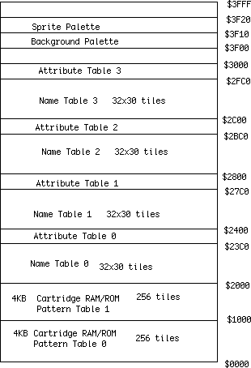
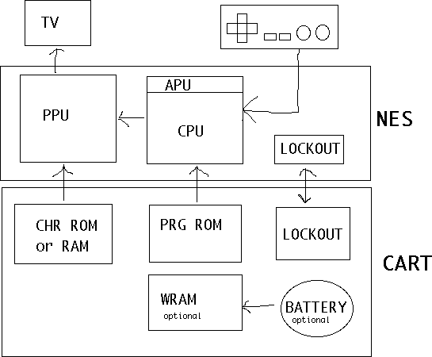

# NES Homebrew Tutorial Notes from Nerdy Nights

Decimal - Base 10, with a number system as 100, 10, 1. Basically if you remove a zero a number is 10 times smaller.

Binary - Base 2, with a number system as 4, 2, 1. Binary numbers look something like this: 11111110 and if a zero was removed, the number becomes 2 times smaller.

Hex - Base 16, with a number system as $100 (or 256), $10 (or 16), and 1. Makes binary obsolete for coding purposes.

Memory - The NES can access 2^16 bytes of memory, or 65,536 bytes.

Instructions - The NES processor only has 56 instructions.

Variables - A place that store data that can be modified.

Control flow - When an instruction is run based on a variable, kind of like: if x is this, then x happens, else, x happens. 

KB - 1 kilobyte is 1024 bytes, and 1 byte is 8 bits. 

ROM - The result of the compiled assembly code, and also what is used to play NES games. The ROM should be 40,976 bytes, with the INES header being 16 bytes. 

RAM - Holds data that can be read and written. Without a battery, when the power is removed, the data in the RAM is erased.

PRG - Program code for the game, which is 32,768 bytes.

CHR - Graphics data for the game, which is 8,192 bytes.

CPU - The main processor for NES. All cycles are either read or write. 

PPU - Contains 10 kilobytes of memory, which contains 2 kilobytes of RAM and 8 kilobytes for CHR-ROM or CHR-RAM. It displays a video signal.

APU - Where sound is processed.

4-screen RAM - Holds 4 screens of background instead of 2 screens. It is not common.

WRAM - Also called Work RAM, it is used to save games. Not common.

Lockout Chip - It controls the resetting of the console, and there are 4 versions of the lockout chip. If the revision number is 05, it has the least lockout-defeater protection, if the revision number is 07 and 09, it has some lockout protection, but if the revision number is 11, it has the most lockout protection and most lockout defeaters fail.

Tiles - All graphics are made up of 8x8 tiles. The advantage of the tile system is that less memory is needed, but 3D graphics aren't possible.

Sprites - The PPU has enough memory for 64 sprites, but no more than 8 sprites can be on-screen at a time.

Background - Sprites can either be displayed in front or behind the background, and there is enough internal RAM to hold 2 screens of background. 

Pattern Tables - They are either stored on the CHR-ROM or CHR-RAM of the cart. Each pattern table holds 256 tiles, with one table holding background info and another holding sprite info.

Attribute Tables - These tables set the color info in 2x2 sections, meaning a 16x16 section can only hold 4 different colors from the palette.

Palettes - These two areas hold color information, one from the background and one from the sprites. The palette has 16 colors.

Bit - The smallest unit in computers. Either 0 or 1.

Byte - 8 bits form a byte, a number from 0 to 255.

Instruction - A command a processor executes.

Assembly basics

Directives - Commands sent to assembler.

Labels - Makes code easier to organize, and the assembler translates a label into an address.

Opcodes - Commands sent to processor.

Operands - A part of an instruction that specifies the data to be manipulated.

Comments - Helps readers understand the code.

NES Diagram

$0000-0800 - Internal RAM, 2KB chip in the NES

$2000-2007 - PPU access ports

$4000-4017 - Audio and controller access ports

$6000-7FFF - Optional WRAM inside the game cart

$8000-FFFF - Game cart ROM

Note - #$05 means the value 5, but $0005 means the address $0005. There are 56 different types of instructions and they start with a three-character code called an opcode.

Register - Place inside a processor that holds a value.

Accumulator - Main register for loading, storing, comparing, and doing math on data.

Index Register X - Used for counting or memory access. Used to keep track of how many times a loop has run.

Index Register Y - Almost the same as Index Register X.

Status Register - Holds flags with info about the last instruction. It can check if a result is a zero.

Common Instructions

LDA - Load a value into the accumulator.

LDX - Load a value into Index Register X.

LDY - Load a value into Index Register Y.

STA - Store a value from the accumulator.

STX - Store a value from Index Register X.

STY - Store a value from Index Register Y.

TAX - Transfer the value from the accumulator into Index Register X.

TAY - Transfer the value from the accumulator into Index Register Y.

TXA - Transfer the value from Index Register X into the accumulator.

TYA - Transfer the value from Index Register Y into the accumulator.

ADC - Add with carry.

SBC - Subtract with carry.

CLC - Clear carry flag, should be used before ADC.

SEC - Set carry flag, should be used before SBC.

INC - Increment a value.

DEC - Decrement a value.

INY - Increment Y.

INX - Increment X.

DEY - Decrement Y.

DEX - Decrement X.

ASL - Shift all bits in either the accumulator or an address one position to the left. Multiply by 2.

LSR - Shift all bits in either the accumulator or an address one position to the right. Divide by 2.

CMP - Compare a variable or label to a specified value.

CPX - Compare X to a specified value.

CPY - Compare Y to a specified value.

JMP - Jump to a specified address.

BEQ - Branch if equal, if zero is set (values were equal) the code jumps to $FF00 and runs there. If zero is clear (values were not equal), there is no jump and the processor runs the next instruction.

BNE - Branch if not equal, if zero is set (value were not equal) the code jumps to $FF00 and runs there. If zero is clear (values were equal), there is no jump and the processor runs the next instruction.

Note - If a result is zero, the zero flag is set.

NES Code Structure

iNES Header - Gives the emulator the info about the game such as mapper, grahpics mirroring, and PRG/CHR sizes. Mappers are used to increase the space in the game, and mirroring happens when the same memory appears at more than one range of addresses. Each bank of PRG is 16KB and each bank of CHR is 8KB. For PRG, write .inesprg x, for chr, write .ineschr x, for mapper, write .inesmap x, and for mirroring, write .inesmir x. X is the number value that is entered in the code.

Banking - Nesasm arranges everything in 8KB code and 8KB graphics banks. Write the code like this: for every $2000 addresses, write .bank x, with x increasing by 1 for every $2000 addresses and starting at 0.

Adding Binary Files - Use the .incbin directive to include a binary file. The most common binary file is a chr-rom file.

Vectors - Three vectors interrupt code and jump to new locations. They are held in PRG-ROM and they tell the processor where to go when that happens. All of these vectors must always appear in the assembly file in the right order.

NMI Vector - This happens once per frame when enabled. The PPU tells the processor it is starting the VBlank time and can update graphics.

RESET Vector - This happens either when the NES starts up or when the reset button is hit.

IRQ Vector - This is triggered from some mapper chips or audio interrupts.

Data Word - A data word (.dw) is 2 bytes long.

Correct Code for Vectors

.bank x ;x being the numbered 8KB bank

.org $FFFA ;where code jumps to when BNE or BEQ is called

.dw NMI ;when an NMI happens, if enabled, the processor will jump to the label NMI:

.dw RESET ;when the processor turns on or reset is pressed, it will jump to the label RESET:

.dw IRQ ;when triggered, jump to the label IRQ:

Reset Code - Because the reset vector was set to the label RESET, when the processor starts up, it will start from RESET. The .org directive sets the code into a space in the game ROM. There is no such thing as a decimal mode in the 6502 processor for the NES. This does not include code that runs on a real console, only on a FCEUX emulator.

Reset Code Diagram

.bank x ;x being the numbered 8KB bank

.org $X000 ;for every $2000 addresses, x increases by 1

RESET: ;the actual reset label

SEI ;disable IRQs

CLD ;disable decimal mode

First program - An entire screen of one color. The color is displayed to address $2001, or the constant PPUMASK.

Remaining Code

LDA %76543210 ;the color displayed

STA $2001 ;the address to display the color

Forever: ;the label that makes everything go forever

JMP Forever ;infinite loop

Color Diagram

76543210

||||||||

|||||||+- Grayscale (0: normal color; 1: AND all palette entries

|||||||   with 0x30, effectively producing a monochrome display;

|||||||   note that colour emphasis STILL works when this is on!)

||||||+-- Disable background clipping in leftmost 8 pixels of screen

|||||+--- Disable sprite clipping in leftmost 8 pixels of screen

||||+---- Enable background rendering

|||+----- Enable sprite rendering

||+------ Intensify reds (and darken other colors)

|+------- Intensify greens (and darken other colors)

+-------- Intensify blues (and darken other colors)